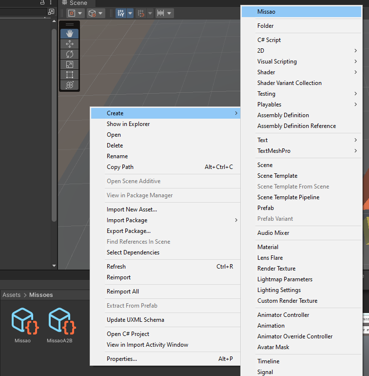
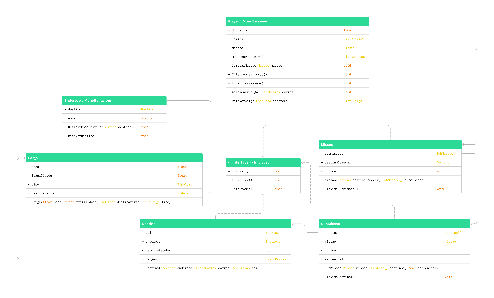
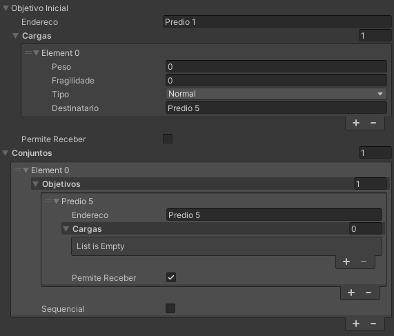

# Sobre Missão [em progresso]
Este documento apresenta um passo a passo de como criar uma missão jogável do jogo Entrega Maluca. Note que ainda não foi terminado pois precisamos nos aprofundar melhor em outros elementos.

## O Scriptable Missão
A Unity possui uma funcionalidade chamada **ScriptableObject**, que nos permite criar objetos como arquivos, que poderão ser lidos por um script no jogo. Cada componente de missão possui seu Scriptable, porém utilizaremos **apenas** o Scriptable da Missão. 

Para criar um novo objeto de missão, primeiramente vá para a pasta designada para missões, lá você deve encontrar outros objetos missões que podem servir de template para você. 

Estando na pasta, clique com o botão direito, selecione Create e então clique em Missao, no topo da lista. 

Nomeie a missão de acordo com o seu **propósito**. Agora temos um objeto Scriptable da Missão, porém ainda não sabemos o que cada campo significa.

## Os campos da Missão
O sistema de missão é um pouco complicado de entender, mas esse é o diagrama, caso isto auxilie em seu entendimento:

Desta forma temos liberdade para criar **qualquer** tipo de missão para o jogo, tudo que precisamos é entender como organizar os elementos para refletirem nossas vontades.

## A importância do Conjunto

Em um mundo ideal uma **missão** seria uma lista de **objetivos**, porém para termos mais liberdade na criação, além de missão e objetivo, temos um conjunto. Um **conjunto** é uma lista de objetivos e pode ser **sequencial** ou não, dessa forma podemos determinar se os objetivos da lista devem ser feitos um atrás do outro ou podem ser feitos em qualquer ordem.

Dessa maneira podemos criar uma missão onde o jogador deve fazer entregas na casa A, depois B e depois C, e após essas entregas, em outro conjunto e mesma missão, fazer entregar nas casas D, E e F, na ordem que quiser desde que entregue todas. Um conjunto só avança para o próximo conjunto quando todos os objetivos que possuir forem concluídos.

## O Objetivo da entrega
Toda entrega é feita em um **endereço**, porém nem todo endereço quer receber algo. Um objetivo relaciona um endereço com uma ação a ser realizada: entregar ou receber uma carga. 

Objetivos possuem uma **lista de cargas**, essa lista são as cargas que você irá receber para entregar ao aproximar do endereço, caso o endereço não queira entregar nenhuma carga, deixe a lista vazia. 

Além disso, há o atributo permite receber que diz se o endereço atual está esperando uma carga, ou seja, caso o jogador possua a carga e se aproximar desse endereço, poderá a entregar. 

Alguns casos como a loja está fechada ou a pessoa não está em casa seriam fatores que um endereço não queira receber a carga, nestes casos você pode definir um outro objetivo onde ele queira receber ou criar um objetivo no endereço do remetente para devolver a carga.

O campo endereço recebe uma string, essa string é o nome do GameObject que possui o script de Endereço. Esses scripts estão diretamente no trigger do endereço, que no desenvolvimento são os blocos amarelos, lembrando que o nome deve estar **idêntico** ao do objeto.